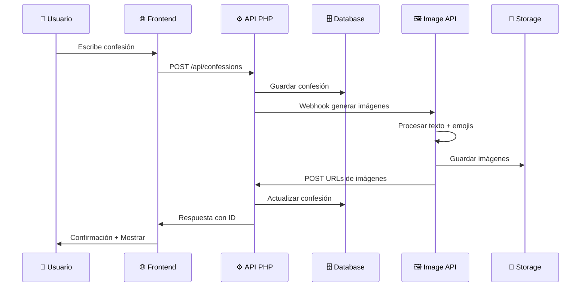

# 📁 Estructura del Proyecto Noot Not

```
noot-not/
├── 📄 README.md                     # Documentación principal (¡estás aquí!)
├── 🚀 deploy.sh                     # Script maestro de deployment
├── 🧹 cleanup.sh                    # Script de limpieza automática
├── 🐳 docker-compose.yml            # Orquestación de servicios principales
├── 📊 docker-compose.monitoring.yml # Stack de monitoreo opcional
├── 🔧 .env.production.example       # Plantilla de configuración
├── 🔐 .gitignore                    # Archivos ignorados por Git
├── 📋 DEPLOYMENT.md                 # Guía detallada de deployment
│
├── 🌐 noot-not-front/              # Frontend React + TypeScript
│   ├── 📦 package.json             # Dependencias y scripts NPM
│   ├── ⚡ vite.config.ts           # Configuración de Vite
│   ├── 🎨 src/
│   │   ├── 🧩 components/          # Componentes React reutilizables
│   │   │   ├── ConfessionCard.tsx  # Tarjeta de confesión
│   │   │   ├── ConfessionForm.tsx  # Formulario de nueva confesión
│   │   │   └── VoteButton.tsx      # Botones de votación
│   │   ├── 🎣 hooks/               # Custom React hooks
│   │   │   ├── useConfessions.ts   # Hook para manejar confesiones
│   │   │   └── useVoting.ts        # Hook para sistema de votos
│   │   ├── 🛠️ services/            # Servicios de API
│   │   │   └── api.ts              # Cliente Axios configurado
│   │   ├── 🏗️ contexts/            # Contextos React
│   │   ├── 🎯 types.ts             # Definiciones TypeScript
│   │   └── 🎨 theme.ts             # Tema Material-UI
│   ├── 🐳 Dockerfile               # Container del frontend
│   ├── 🌐 nginx.conf               # Configuración Nginx
│   └── 🚫 .dockerignore            # Archivos excluidos del build
│
├── ⚙️ noot-not-api/                # Backend PHP + API REST
│   ├── 🎼 composer.json            # Dependencias y autoload PHP
│   ├── 🗂️ src/
│   │   ├── 🎛️ Controllers/         # Controladores de la API
│   │   │   └── ConfessionController.php
│   │   ├── 🗄️ Models/              # Modelos de datos
│   │   │   └── Confession.php      # Modelo de confesión
│   │   ├── 🔗 Database/            # Conexión a base de datos
│   │   │   └── Connection.php      # PDO connection manager
│   │   ├── 🛡️ Middleware/          # Middleware personalizado
│   │   │   ├── CorsMiddleware.php  # Manejo de CORS
│   │   │   └── JsonBodyParserMiddleware.php
│   │   └── 🔧 Services/            # Servicios de negocio
│   │       └── ModerationService.php
│   ├── 🌐 public/
│   │   ├── 📍 index.php            # Punto de entrada
│   │   └── 🖼️ images/              # Imágenes generadas
│   ├── 📊 migrations/              # Scripts de base de datos
│   │   └── run.php                 # Ejecutor de migraciones
│   ├── 🧪 tests/                   # Tests unitarios PHPUnit
│   ├── 🐳 Dockerfile               # Container del backend
│   ├── 🔧 docker/
│   │   └── apache.conf             # Configuración Apache
│   └── 📖 API.md                   # Documentación de la API
│
├── 🖼️ noot-not-image-api/          # Servicio Python de Imágenes
│   ├── 🐍 app.py                   # Aplicación Flask principal
│   ├── 🎨 image_generator.py       # Generador de imágenes PIL
│   ├── 📦 requirements.txt         # Dependencias Python
│   ├── 💎 assets/
│   │   ├── 🔤 fonts/               # Fuentes Noto Sans y Emoji
│   │   │   ├── NotoSans-Regular.ttf
│   │   │   ├── noto-emoji-bw.ttf   # Emojis en blanco y negro
│   │   │   └── NotoColorEmoji.ttf  # Emojis a color
│   │   ├── 🖼️ images/              # Imágenes generadas
│   │   │   └── generated/          # Directorio de salida
│   │   └── 🎭 backgrounds/         # Fondos para imágenes
│   ├── 🐳 Dockerfile               # Container Python
│   ├── 🌐 nginx/                   # Configuración Nginx (opcional)
│   └── ⚙️ .env.example             # Variables de entorno
│
├── 🔄 nginx/                       # Reverse Proxy Principal
│   ├── 📋 nginx.conf               # Configuración global
│   ├── 🌐 conf.d/
│   │   └── default.conf            # Virtual hosts
│   └── 🔐 ssl/                     # Certificados SSL
│       ├── nootnot.rocks.crt
│       ├── nootnot.rocks.key
│       ├── api.nootnot.rocks.crt
│       └── api.nootnot.rocks.key
│
└── 📊 monitoring/                  # Stack de Monitoreo (Opcional)
    ├── prometheus.yml              # Configuración Prometheus
    └── alertmanager.yml            # Configuración de alertas
```

## 🎯 Flujo de Datos



## 🔧 Configuraciones por Entorno

### 🛠️ Desarrollo Local

```bash
# Variables de entorno para desarrollo
DEBUG=true
API_BASE_URL=http://localhost:8000
IMAGE_API_URL=http://localhost:8001
DB_HOST=localhost
CORS_ORIGIN=http://localhost:3000
```

### 🚀 Producción

```bash
# Variables de entorno para producción
DEBUG=false
API_BASE_URL=https://api.nootnot.rocks
IMAGE_API_URL=https://image-api.nootnot.rocks
DB_HOST=db
CORS_ORIGIN=https://nootnot.rocks
```

## 📊 Base de Datos

### 📋 Esquema Principal

```sql
-- Tabla de confesiones
CREATE TABLE confessions (
    id INT PRIMARY KEY AUTO_INCREMENT,
    content TEXT NOT NULL,
    upvotes INT DEFAULT 0,
    downvotes INT DEFAULT 0,
    reported BOOLEAN DEFAULT FALSE,
    image_urls JSON,
    created_at TIMESTAMP DEFAULT CURRENT_TIMESTAMP,
    updated_at TIMESTAMP DEFAULT CURRENT_TIMESTAMP ON UPDATE CURRENT_TIMESTAMP,
    user_ip VARCHAR(45),
    moderation_status ENUM('pending', 'approved', 'rejected') DEFAULT 'pending'
);

-- Tabla de votos (prevenir duplicados)
CREATE TABLE confession_votes (
    id INT PRIMARY KEY AUTO_INCREMENT,
    confession_id INT NOT NULL,
    user_ip VARCHAR(45) NOT NULL,
    user_fingerprint VARCHAR(255),
    vote_type ENUM('up', 'down') NOT NULL,
    created_at TIMESTAMP DEFAULT CURRENT_TIMESTAMP,
    FOREIGN KEY (confession_id) REFERENCES confessions(id) ON DELETE CASCADE,
    UNIQUE KEY unique_vote (confession_id, user_ip, user_fingerprint)
);

-- Índices para rendimiento
CREATE INDEX idx_confessions_created_at ON confessions(created_at);
CREATE INDEX idx_confession_votes_confession_id ON confession_votes(confession_id);
CREATE INDEX idx_confession_votes_ip ON confession_votes(user_ip);
```

## 🐳 Contenedores Docker

### 📊 Resumen de Servicios

| Servicio     | Puerto | Descripción   | Recursos  |
| ------------ | ------ | ------------- | --------- |
| 🌐 Frontend  | 3000   | React + Nginx | 512MB RAM |
| ⚙️ API       | 8000   | PHP + Apache  | 1GB RAM   |
| 🗄️ Database  | 3306   | MariaDB 10.6  | 2GB RAM   |
| 🖼️ Image API | 8001   | Python Flask  | 1GB RAM   |
| 🔄 Nginx     | 80/443 | Reverse Proxy | 256MB RAM |

### 🔄 Health Checks

Todos los servicios incluyen health checks automáticos:

```yaml
# Ejemplo de health check
healthcheck:
  test: ["CMD", "curl", "-f", "http://localhost/api/health"]
  interval: 30s
  timeout: 10s
  retries: 3
  start_period: 40s
```

## 🛡️ Seguridad

### 🔐 Medidas Implementadas

1. **🌐 CORS Configurado**

   - Orígenes específicos permitidos
   - Headers y métodos controlados
   - Credentials manejados apropiadamente

2. **⚡ Rate Limiting**

   - 10 req/s para API general
   - 5 req/s para generación de imágenes
   - 30 req/s para frontend

3. **🛡️ Headers de Seguridad**

   ```nginx
   add_header X-Frame-Options DENY;
   add_header X-Content-Type-Options nosniff;
   add_header X-XSS-Protection "1; mode=block";
   add_header Strict-Transport-Security "max-age=63072000";
   ```

4. **🔒 Validación de Entrada**
   - Sanitización de texto
   - Validación de longitud
   - Escape de caracteres especiales

### 🎯 Anti-Abuse

```php
// Sistema de detección de votos duplicados
class VoteValidator {
    public function canVote(string $ip, string $fingerprint, int $confessionId): bool {
        // Verificar si ya votó esta IP + fingerprint
        // Implementa cooldown periods
        // Detecta patrones de abuse
    }
}
```

## 📈 Optimizaciones

### ⚡ Performance

1. **🗄️ Base de Datos**

   - Índices optimizados
   - Consultas preparadas
   - Connection pooling

2. **🌐 Frontend**

   - Code splitting
   - Lazy loading
   - Service workers (futuro)

3. **🖼️ Imágenes**
   - Compresión automática
   - Formatos optimizados
   - Cache headers

### 📊 Monitoreo

```bash
# Métricas disponibles
- Tiempo de respuesta de API
- Uso de memoria por contenedor
- Tasa de errores
- Número de confesiones por hora
- Uso de almacenamiento
```

## 🔄 CI/CD Pipeline (Futuro)

```yaml
# Ejemplo de GitHub Actions
name: Deploy Noot Not
on:
  push:
    branches: [main]
jobs:
  test:
    runs-on: ubuntu-latest
    steps:
      - uses: actions/checkout@v2
      - name: Run tests
        run: |
          docker-compose -f docker-compose.test.yml up --abort-on-container-exit

  deploy:
    needs: test
    runs-on: ubuntu-latest
    steps:
      - name: Deploy to production
        run: |
          ./deploy.sh all production
```

---

<div align="center">

**🎯 Estructura diseñada para escalabilidad y mantenibilidad**

_Cada componente tiene una responsabilidad específica y bien definida_

</div>
